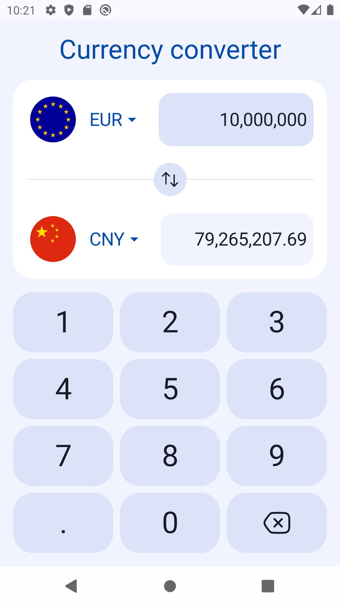
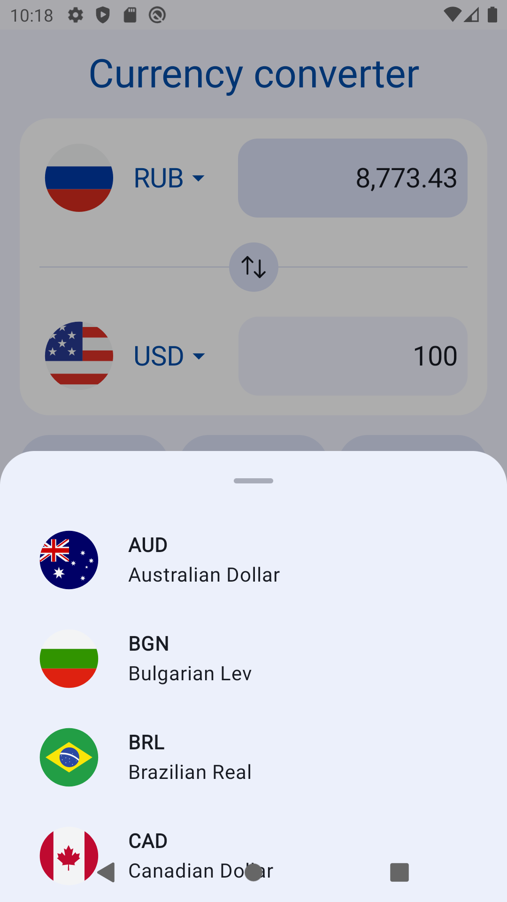
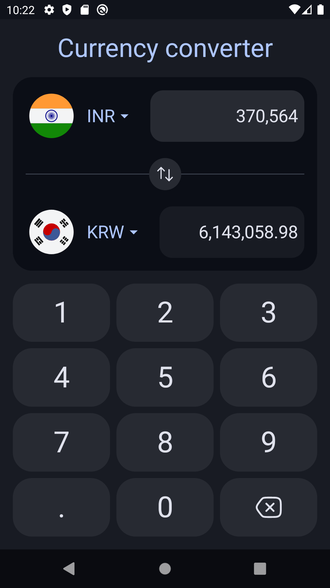

# CURRENCY CONVERTER

**CurrencyConverter** is an Android application developed as part of a test assignment for VK.
It fetches exchange rate data from the [FreecurrencyAPI](https://freecurrencyapi.com/) API and allows users to convert between various currencies.

## Installation

1. **Clone the repository**:
    ```sh
    git clone https://github.com/LeSalang/CurrencyConverter.git
    ```
2. **Open the project in Android Studio**

3. **Add your API key**:
    - Create `local.properties` file in the root directory of the project.
    - Add your API key in the following format:
      ```properties
      API_KEY = your_api_key_here
      ```

4. **Build and run the project**
   
## Technologies Used
- Platform: [Android](https://developer.android.com)
- Language: [Kotlin](https://kotlinlang.org/)
- UI: [Jetpack Compose](https://developer.android.com/develop/ui/compose)
- Concurrency: [KotlinX Coroutines](https://github.com/Kotlin/kotlinx.coroutines)
- Serialization: [KotlinX Serialization](https://github.com/Kotlin/kotlinx.serialization)
- Network: [Retrofit](https://square.github.io/retrofit/) + [OkHttp](https://square.github.io/okhttp/)
- Dependency Injection: [Dagger](https://dagger.dev) + [Hilt](https://dagger.dev/hilt/)
- Data Storage: [Protobuf DataStore](https://developer.android.com/topic/libraries/architecture/datastore)

### Screenshots

<p align="center">
&nbsp;&nbsp;
</p>
